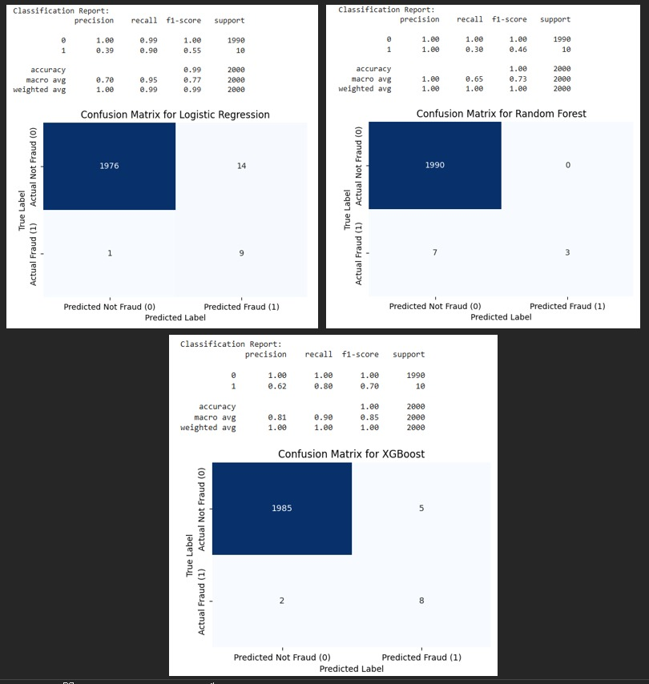
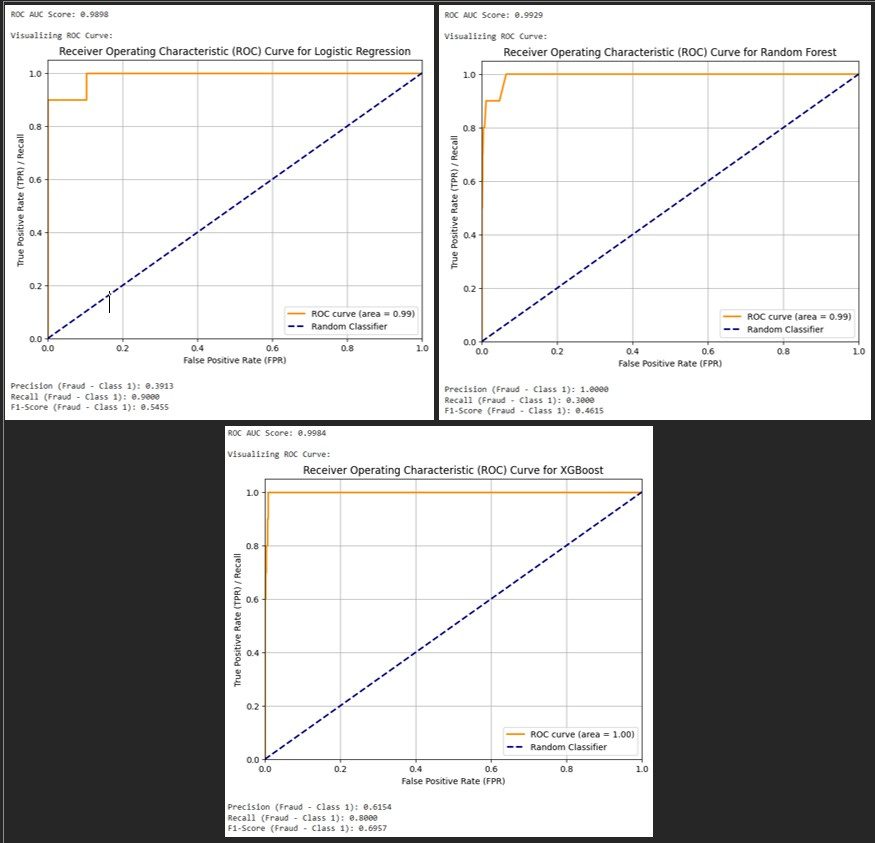

# Fraud Detection Project

## Overview

This repository contains a Jupyter Notebook (`Fraud_Detection (1).ipynb`) exploring a machine learning model for fraud detection using transaction data. The project aims to identify fraudulent transactions, showcasing the performance of different classification algorithms.

---

## Contents

* `Fraud_Detection (1).ipynb`: The main Jupyter Notebook containing data analysis, model training, evaluation, and visualizations.
* `images/`: Directory containing screenshots of model performance metrics.
* `README.md`: This file, providing an overview of the project.
* `requirements.txt`: Lists all necessary Python dependencies.

---

## Setup & Run

To set up and run this project locally, follow these steps:

1.  **Clone this repository:**
    ```bash
    git clone [https://github.com/ANewShaman/Fraud-Detection-Watson-Studio-Replica.git](https://github.com/ANewShaman/Fraud-Detection-Watson-Studio-Replica.git)
    cd Fraud-Detection-Watson-Studio-Replica # Or 'cd Downloads' if that's where you initialized
    ```

2.  **Create a virtual environment (recommended):**
    ```bash
    python -m venv venv
    # On Windows:
    .\venv\Scripts\activate
    # On macOS/Linux:
    source venv/bin/activate
    ```

3.  **Install dependencies:**
    *(Ensure you've generated `requirements.txt` using `pip freeze > requirements.txt` after installing all libraries you used in your notebook.)*
    ```bash
    pip install -r requirements.txt
    ```

4.  **Launch Jupyter Notebook:**
    ```bash
    jupyter notebook
    ```
    This will open Jupyter in your web browser. From there, you can open and run the `Fraud_Detection (1).ipynb` notebook.

---

## Technologies Used

* **Python**
* **Google Colab**
* **Pandas** (for data manipulation)
* **NumPy** (for numerical operations)
* **Scikit-learn** (for machine learning models and utilities)
* **Matplotlib / Seaborn** (for data visualization)

---

## Results and Model Performance

This project evaluated several machine learning algorithms for fraud detection. The classification reports, confusion matrices, and ROC curves below illustrate their performance.

### Confusion Matrices and Classification Reports



* **Key Observations (from Confusion Matrices):**
    * **Logistic Regression:** Shows decent overall accuracy but with a lower F1-score for fraud (Class 1) compared to other models.
    * **Random Forest:** Showed high precision for fraud detection but relatively low recall, meaning it missed a significant portion of actual fraudulent transactions.
    * **XGBoost:** Provided the best balance of precision and recall for fraud, as indicated by its higher F1-score (0.70) for Class 1.

### Receiver Operating Characteristic (ROC) Curves



* **Key Observations (from ROC Curves):**
    * The **Area Under the Curve (AUC)** is a crucial metric here. An AUC close to 1.0 indicates excellent discriminative ability.
    * **Logistic Regression (AUC = 0.99):** Shows strong performance, with its curve hugging the top-left corner, indicating a good true positive rate with a low false positive rate.
    * **Random Forest (AUC = 0.99):** Also performs very well, similar to Logistic Regression in terms of overall discriminative power.
    * **XGBoost (AUC = 1.00):** Achieved a perfect AUC score, suggesting it can perfectly distinguish between fraudulent and non-fraudulent transactions based on its learned thresholds in this specific dataset. This indicates outstanding performance.

*In summary, while all models showed high AUC, **XGBoost appears to be the most robust classifier** for this fraud detection task, providing the best overall balance of identifying fraudulent activities effectively.*
